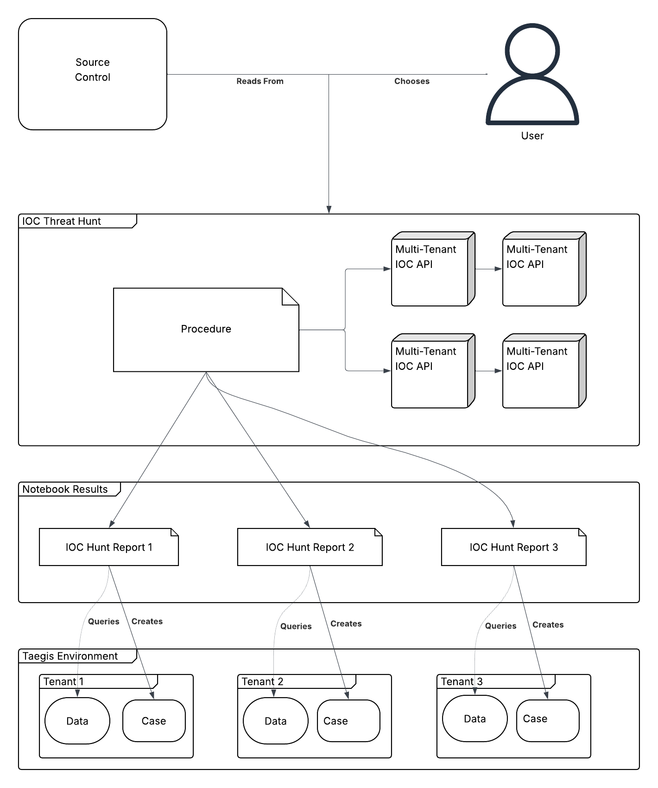

# Taegis Magic

## IOC Threat Hunting Example



[Example Files](../../examples/ioc_threat_hunt/)

The Indicator of Compromise Threat Hunt example is a tool meant to reduce the overall complexity of hunting via an list of File Hashes, IP addresses and Domain Names against the Taegis Data Lake.  Access to the Multi-Tenant IOC API is needed.

### Configuration

Configuration may be separated from the Jupyter Notebook using a YAML file in accordance with Papermill parameters.  Parameters can be assigned via papermill or the `taegis notebook execute` command.

* `region`
    * authentication region, does not limit regions for tenant queries
* `organization_id`
    * Partner or Organization ID for child tenants
* `tenant_ids`
    * List of child tenant IDs
* `services`
    * List of Taegis Services
* `title`
    * Title of Hunt (Defaults to `IOC Hunt - YYYY-MM-DD`)
* `description`
    * Description of Hunt to add to Key Findings
* `ioc_file`
    * Line deliminated file with indicators
* `iocs`
    * Provide indicators straight from the configuration file
* `days`
    * Relative amount of previous days to back search

### Workflow

The IOC Threat Hunt example will lookup the available tenants for the defined partner (or organization) or the first tenant granted permissions of the user account.

Tenants will be separated by first enabled region.

Initial IOC searches will be threaded by region.  1 result per region will be returned.  This result may be paginated when the amount of rows exceed 1000.  Regioned results will be combined into a single DataFrame for review.

Tenants without indidactors will have a null findings Case created and a report showing the timeframe and indicators included.

Tenants with indicators will have an additional IOC Hunt Report notebook executed within a Python Process Pool.  The Notebook will be parameterized with the IOCs found in the Multi-Tenant IOC API and raw results will be included in the report.  Searches will be attached to the report, but alerts and events will not.  The default views and stack counts will be provided in the report.

### Example Usage

```bash
taegis notebook execute -f ioc_threat_hunt_params.yaml ioc_threat_hunt.ipynb ioc_threat_hunt_gold_blade.ipynb
```

### References

https://detect-respond.blogspot.com/2013/03/the-pyramid-of-pain.html
https://papermill.readthedocs.io/en/latest/